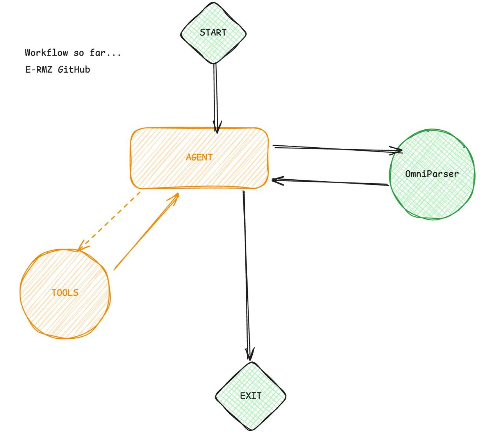

<div align="center">
  
</div>


```markdown
# 🧠 Enhanced Desktop Agent with OmniParser & PyAutoGUI

This project provides an advanced toolkit for automating desktop browser interactions and system-level operations using LLM-based agents. The enhanced agent combines browser automation, visual screen analysis, and direct system interaction capabilities.

---

## ✨ New Features (Enhanced Agent)

### 🔍 **OmniParser Integration**
- **Visual Screen Analysis**: Automatically analyzes screenshots to identify clickable elements and their coordinates
- **Element Detection**: Uses Microsoft's OmniParser-v2 to detect UI elements, buttons, text fields, and interactive components
- **Coordinate Extraction**: Provides precise (x,y) coordinates for automated interaction

### 🖱️ **PyAutoGUI System Integration**
- **Direct System Clicks**: Click at any screen coordinates outside the browser
- **Text Input**: Type text at any cursor position across applications
- **Cross-Application Control**: Interact with any GUI application on the system

### ⏰ **Enhanced Workflow Management**
- **10-Second Step Delays**: Automatic waiting between major operations for stability
- **Improved Error Handling**: Better logging and error recovery
- **Coordinated Tool Execution**: Seamless integration between browser, analysis, and system tools

---

## 🛠 Installation and Setup

It is recommended to install all dependencies using the **[uv](https://docs.astral.sh/uv/)** package manager:

```bash
uv venv
uv add <your packages>
````

### 🔐 Environment Variables

Create a `.env` file in the root of your project and add the following keys:

```env
GOOGLE_API_KEY="your-api-key"
GOOGLE_MODEL=gemini-2.0-flash
PLAYWRIGHT_HEADLESS=false
```

---

## 📁 Project Files Overview

### 🚀 **Enhanced Agent (Recommended)**

#### `playwright_direct_agent.py` ⭐
The **flagship enhanced agent** that combines multiple automation capabilities:

**Available Tools:**
- **Browser Tools**: Launch, navigate, wait, screenshot, close
- **Analysis Tools**: `omniparser_analyze` - Visual screen element detection
- **Interaction Tools**: `pyautogui_click` - System-level clicking, `pyautogui_type` - Text input

**Enhanced Workflow:**
1. Browser automation with Playwright
2. Visual screen analysis with OmniParser
3. System-level interaction with PyAutoGUI
4. 10-second delays between major steps for stability

**Example Commands:**
> "Open google.com, analyze the screen to find the search box, click on it, and type 'hello world'"

> "Navigate to youtube.com, wait 10 seconds, take a screenshot, analyze it to find clickable elements"

#### `test_enhanced_agent.py`
Test script to verify all enhanced agent tools work correctly.

### 📊 **Analysis & Utilities**

#### `omniparser_Api.py`
- Standalone OmniParser API integration
- Takes system screenshots and analyzes UI elements
- Saves processed results and coordinates

#### `omniparser_API_overcolab.ipynb`
- Colab-compatible notebook for OmniParser setup
- Resolves Microsoft repository compatibility issues
- Can be deployed as Gradio/Ngrok API service

### 🔧 **Legacy/Alternative Implementations**

#### `main.py`
Original MCP server client implementation (experimental - use enhanced agent instead)

---

## 🎯 Usage Examples

### Basic Browser + Analysis Workflow
```python
# The agent will automatically:
# 1. Launch browser (10s wait)
# 2. Navigate to URL (10s wait) 
# 3. Take screenshot (10s wait)
# 4. Analyze screen with OmniParser (10s wait)
# 5. Provide clickable coordinates

"Open reddit.com and analyze what elements I can interact with"
```

### System-Level Interaction
```python
# Cross-application automation:
"Open google.com, find the search box coordinates, click on it, and type my search query"
```

### Advanced Multi-Step Automation
```python
# Complex workflows with visual analysis:
"Navigate to amazon.com, analyze the screen to find the search bar, click it, type 'laptop', then find and click the search button"
```

---

## �� Notes

* Tested on macOS (Apple Silicon)
* Enhanced agent requires active display (not headless for PyAutoGUI)
* OmniParser requires internet connection to Hugging Face Spaces
* All tools include comprehensive logging and error handling

---

## 🔄 Workflow Architecture

```
User Command → Enhanced Agent → Tools Coordination:
                                ├── Browser (Playwright)
                                ├── Analysis (OmniParser) 
                                ├── Interaction (PyAutoGUI)
                                └── 10s Delays Between Steps
```

The enhanced agent intelligently coordinates between browser automation, visual analysis, and system interaction to provide seamless desktop automation capabilities.
